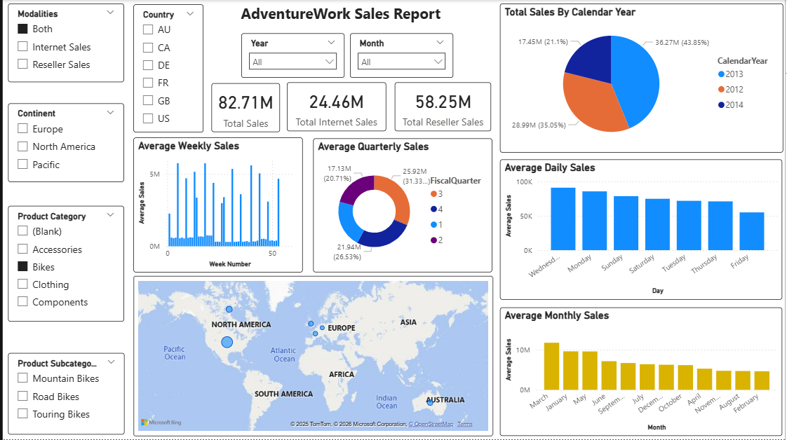

# AdventureWorks Data Warehouse & BI Project

## Screenshots

## Project Overview

This project implements a full Business Intelligence pipeline using:

- SQL Server
- SSIS (ETL)
- SSAS Tabular
- Power BI

Based on AdventureWorks2014 database.

##  Architecture

OLTP → Staging → Data Warehouse → SSAS → Power BI

## 🗄 Data Warehouse Schema

- FactInternetSales
- FactResellerSales
- FactEmployeePay
- Dimensions:
  - DimDate
  - DimProduct
  - DimCustomer
  - DimSalesTerritory
  - DimEmployee (SCD Type 2)

##  ETL Process

- Source → Staging using SSIS
- Staging → DW using Stored Procedures & SSIS
- SCD Type 2 implemented for DimEmployee

## Power BI Dashboard

Features:

- Dynamic modality selector (Internet / Reseller / Both)
- KPIs:
  - Total Sales
  - Average Daily / Weekly / Monthly / Quarterly Sales
- Sales by:
  - Year, Month, Country, Continent
  - Category & Subcategory
- Map Visualization

## Screenshots

## How to Run

1. Restore AdventureWorks2014
2. Run SQL scripts
3. Execute SSIS packages
4. Process SSAS model
5. Open Power BI report
